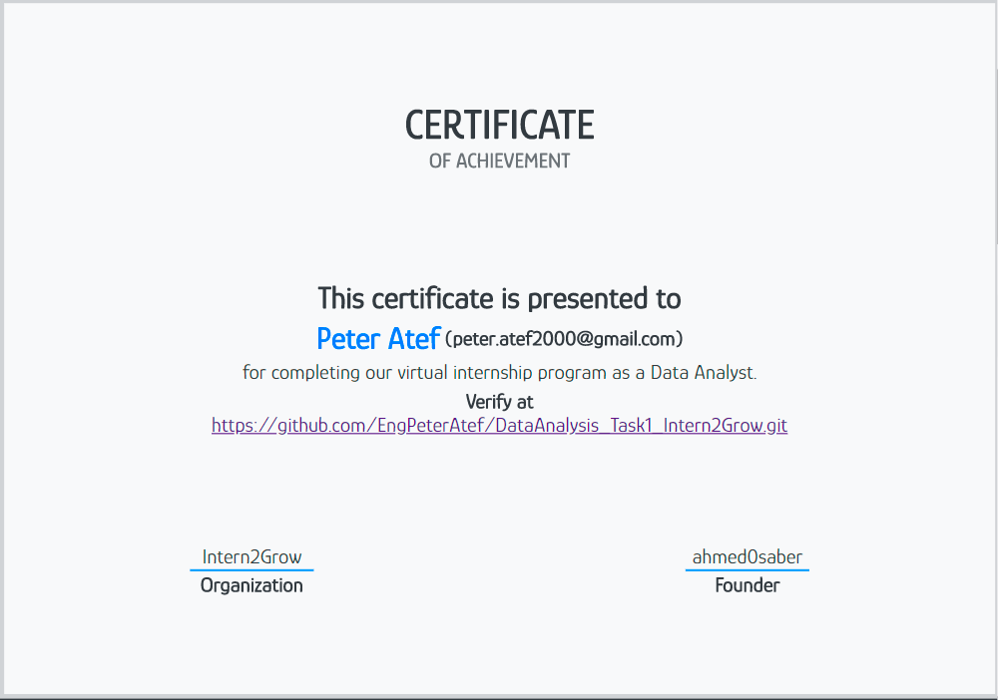

# Sales Data Analysis

An assessment prepared by Intern2Grow, for its Data Analyst Virtual Internship Program.

## Certificate

## Assessment Overview

For this assessment, you will be given a small dataset and a set of questions to answer using that data. You will be expected to use your data analysis skills to answer the questions and present your findings in a clear and concise manner.

## Dataset

The dataset you will be using is a CSV file called sales_data.csv. It contains information about sales made by a fictional company over the course of a year. The columns in the dataset are as follows:

- date: The date of the sale (in YYYY-MM-DD format)
- product: The name of the product sold
- category: The category of the product (e.g. "electronics", "clothing", etc.)
- price: The price of the product (in USD)
- quantity: The quantity of the product sold
- revenue: The total revenue generated by the sale (i.e. price * quantity)

Don't forget to clean the data provided in the CSV file.

## Assessment Questions

1. What was the total revenue generated by the company over the course of the year?
2. Which product had the highest revenue? How much revenue did it generate?
3. What was the average price of a product sold by the company?
4. What was the total quantity of products sold by the company?
5. Which category had the highest revenue? How much revenue did it generate?
6. What was the average revenue per sale?
7. What was the total revenue generated in each quarter of the year? (i.e. Q1, Q2, Q3, Q4)

For each question, please provide the answer and any supporting calculations or visualizations. You may use any tools or programming languages that you are comfortable with.

## Submission Instructions

Please submit your assessment as a report or presentation that includes your answers to the questions, any supporting calculations or visualizations, and a brief summary of your findings. You may also include any additional insights or observations that you think are relevant.
